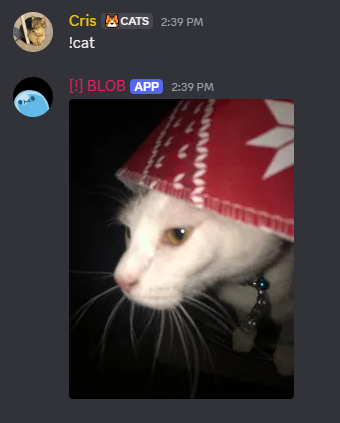
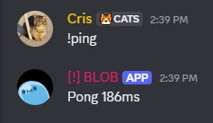
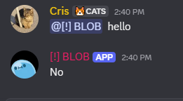
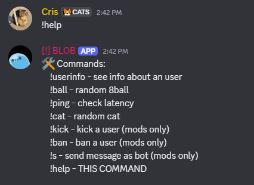

<h1 align="center">BLOB - A Discord Bot</h1>
<p align="center"><i>A simple Discord bot made in discord.py</i></p>

[Getting Started](#getting-started) | [Demo](#demo) | [License](#license) | [Credits](#credits)

## Getting Started
To get started, run this into your computer's terminal:

1. Clone the repository:

   ```bash
   git clone https://github.com/crislazy/blob && cd blob
   ```

2. Install requirements

   ```bash
   pip install -r requirements.txt
   ```

3. Edit variables
   Open the *config.py* file and edit the variables.

4. Run the bot

   ```bash
   python main.py
   ```

## Demo







## License
This project’s source code is licensed under the MIT License.

## Credits
Used ChatGPT for fixing a few bugs